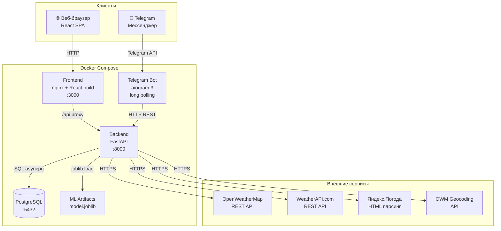
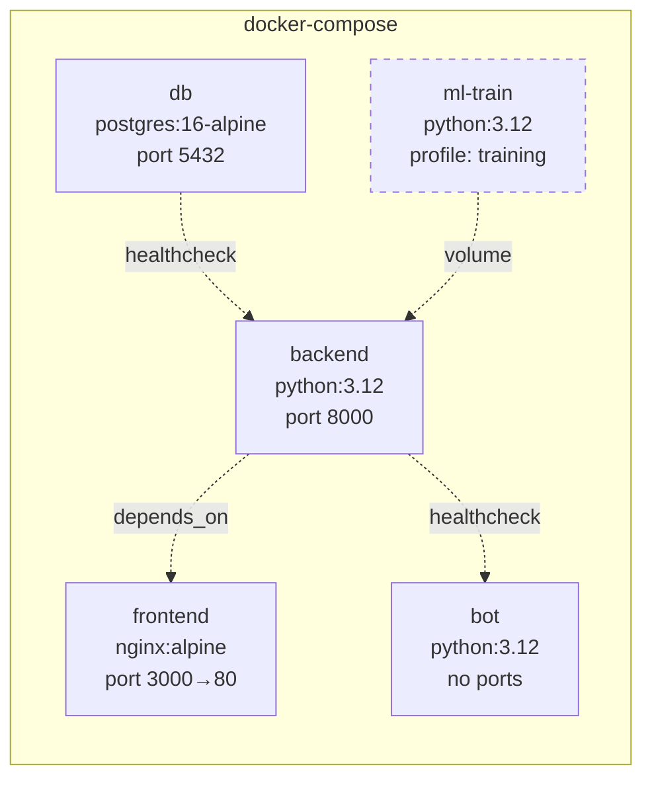
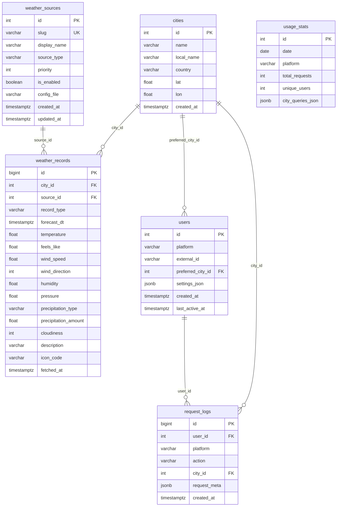
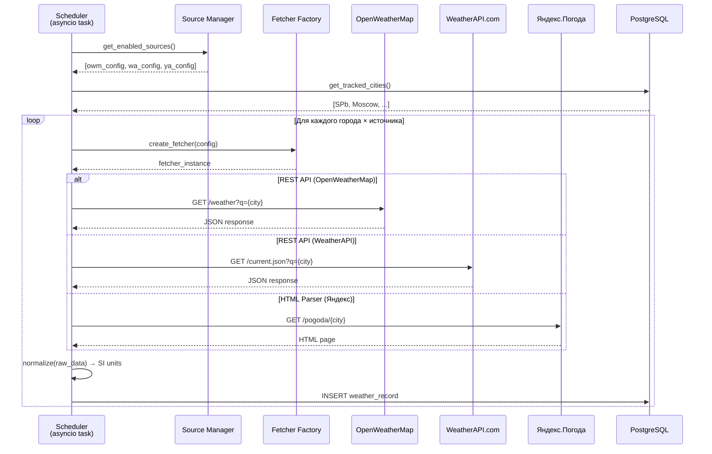
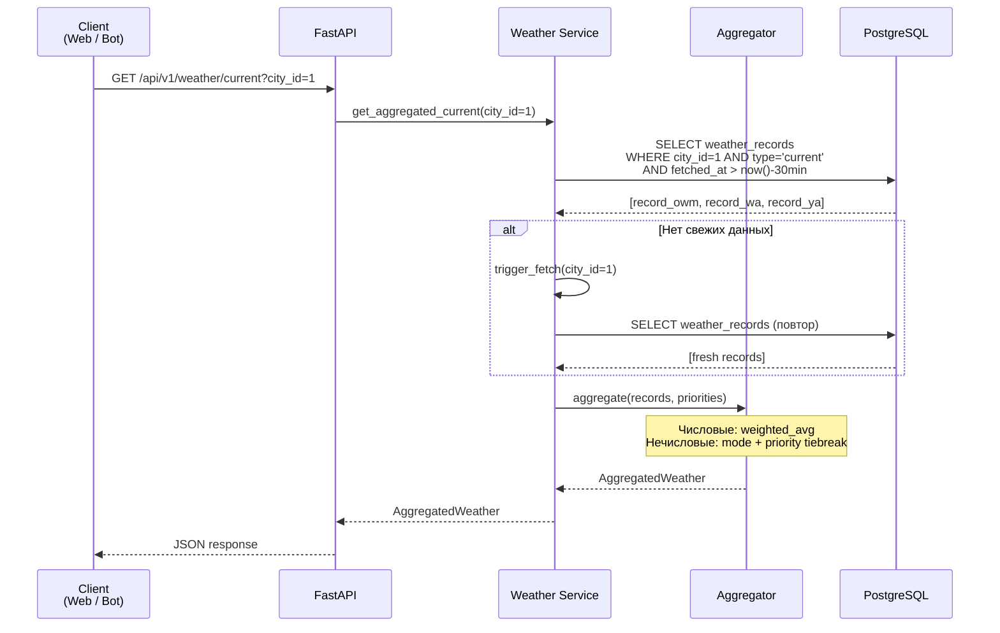
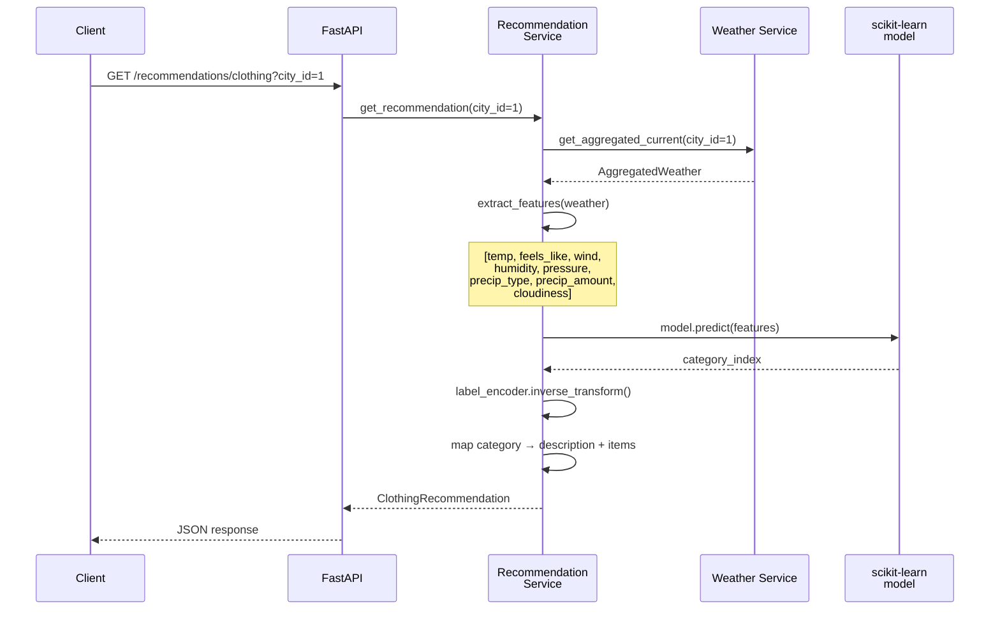
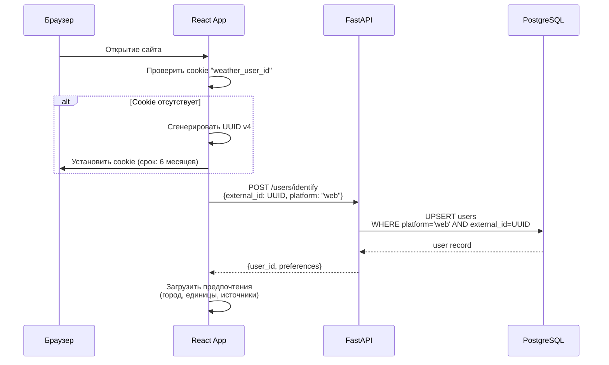
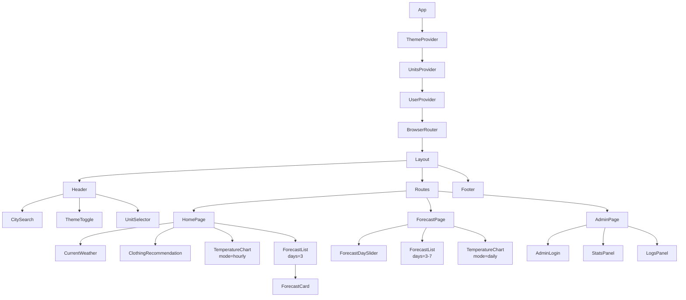
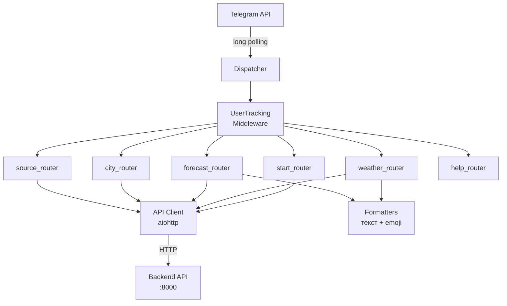

# System Design — Weather Aggregator

## 1. Обзор системы

### 1.1 Назначение

Weather Aggregator — интернет-сервис наблюдения за погодой, который агрегирует данные из нескольких источников (REST API и HTML-парсинг), суммирует их с учётом пользовательских приоритетов, визуализирует через веб-интерфейс и Telegram-бота, а также формирует ML-рекомендации по одежде и аксессуарам.

### 1.2 Основные компоненты

| Компонент | Технология | Назначение |
|-----------|-----------|------------|
| Backend API | FastAPI (Python 3.12) | REST API, сбор данных, агрегация, ML-inference |
| Frontend | React + TypeScript (Vite) | Веб-интерфейс пользователя |
| Telegram Bot | aiogram 3 (Python 3.12) | Интерфейс через мессенджер |
| Database | PostgreSQL 16 | Хранение данных |
| ML Model | scikit-learn | Рекомендации по одежде |
| Infrastructure | Docker Compose | Оркестрация сервисов |

---

## 2. Архитектурная диаграмма

### 2.1 Общая архитектура



### 2.2 Диаграмма сервисов Docker Compose



---

## 3. Структура монорепо

```
trkpo/
├── CLAUDE.md                    # Конвенции проекта для Claude Code
├── docker-compose.yml           # Оркестрация всех сервисов
├── .env.example                 # Шаблон переменных окружения
├── .gitignore
├── README.md
│
├── backend/                     # FastAPI бэкенд
│   ├── Dockerfile
│   ├── requirements.txt
│   ├── alembic.ini
│   ├── alembic/                 # Миграции БД
│   │   └── versions/
│   ├── config/
│   │   ├── settings.yaml        # Главные настройки (БД, планировщик, ML)
│   │   └── sources/             # Конфигурации источников погоды
│   │       ├── openweathermap.yaml
│   │       ├── weatherapi.yaml
│   │       └── yandex_weather.yaml
│   ├── app/
│   │   ├── main.py              # App factory, lifespan
│   │   ├── dependencies.py      # DI: get_db, get_admin
│   │   ├── core/                # Конфиг, БД, безопасность, планировщик
│   │   ├── models/              # ORM-модели (6 таблиц)
│   │   ├── schemas/             # Pydantic-схемы
│   │   ├── api/v1/              # REST эндпоинты
│   │   ├── services/            # Бизнес-логика
│   │   ├── fetchers/            # Сборщики данных (3 источника)
│   │   └── aggregator/          # Движок агрегации
│   └── tests/
│
├── frontend/                    # React + TypeScript SPA
│   ├── Dockerfile               # Multi-stage: node build → nginx serve
│   ├── nginx.conf               # Проксирование /api → backend
│   ├── package.json
│   ├── vite.config.ts
│   └── src/
│       ├── pages/               # 3 страницы + 404
│       ├── components/          # UI-компоненты
│       ├── hooks/               # React hooks
│       ├── context/             # Theme, Units, User
│       ├── api/                 # HTTP-клиент
│       ├── types/               # TypeScript-интерфейсы
│       └── utils/               # Конвертация единиц, даты
│
├── bot/                         # Telegram-бот
│   ├── Dockerfile
│   ├── requirements.txt
│   └── app/
│       ├── handlers/            # Команды: start, weather, forecast, city, source, help
│       ├── keyboards/           # Inline-клавиатуры
│       ├── services/            # API-клиент к бэкенду
│       └── middlewares/         # Трекинг пользователей
│
├── ml/                          # ML-модель рекомендаций
│   ├── Dockerfile
│   ├── requirements.txt
│   ├── generate_dataset.py      # Генерация синтетических данных
│   ├── train.py                 # Обучение и сохранение модели
│   ├── model/                   # Pipeline, фичи, лейблы
│   ├── data/                    # synthetic_weather.csv
│   └── artifacts/               # model.joblib, label_encoder.joblib
│
└── docs/
    ├── functional_specification.pdf
    └── system_design.md          # Этот документ
```

---

## 4. Схема базы данных

### 4.1 ER-диаграмма



### 4.2 Описание таблиц

#### cities — Населённые пункты
| Поле | Тип | Описание |
|------|-----|----------|
| id | INTEGER PK | Автоинкремент |
| name | VARCHAR(255) | Название на английском |
| local_name | VARCHAR(255) | Локализованное название (русское) |
| country | VARCHAR(10) | Код страны (RU, US, ...) |
| lat | FLOAT | Широта |
| lon | FLOAT | Долгота |
| created_at | TIMESTAMPTZ | Дата создания записи |

**Индекс**: `ix_cities_name` по полю `name`
**Уникальность**: (`name`, `country`, `lat`, `lon`)

#### weather_sources — Источники данных
| Поле | Тип | Описание |
|------|-----|----------|
| id | INTEGER PK | Автоинкремент |
| slug | VARCHAR(50) UNIQUE | Уникальный идентификатор (openweathermap, weatherapi, yandex_weather) |
| display_name | VARCHAR(100) | Отображаемое имя |
| source_type | VARCHAR(20) | `api` или `parser` |
| priority | INTEGER | Приоритет по умолчанию (1-10, 1 = высший) |
| is_enabled | BOOLEAN | Включён ли источник |
| config_file | VARCHAR(255) | Путь к YAML-конфигу |
| created_at | TIMESTAMPTZ | Дата создания |
| updated_at | TIMESTAMPTZ | Дата последнего обновления |

#### weather_records — Записи погодных данных
| Поле | Тип | Описание |
|------|-----|----------|
| id | BIGINT PK | Автоинкремент |
| city_id | INTEGER FK → cities | Город |
| source_id | INTEGER FK → weather_sources | Источник |
| record_type | VARCHAR(20) | `current` или `forecast` |
| forecast_dt | TIMESTAMPTZ | Целевая дата/время прогноза (NULL для current) |
| temperature | FLOAT | Температура, °C |
| feels_like | FLOAT | Ощущаемая температура, °C |
| wind_speed | FLOAT | Скорость ветра, м/с |
| wind_direction | INTEGER | Направление ветра, градусы (0-360) |
| humidity | FLOAT | Влажность, % |
| pressure | FLOAT | Давление, гПа |
| precipitation_type | VARCHAR(30) | none / rain / snow / sleet |
| precipitation_amount | FLOAT | Количество осадков, мм |
| cloudiness | INTEGER | Облачность, % |
| description | VARCHAR(255) | Текстовое описание |
| icon_code | VARCHAR(20) | Код иконки для UI |
| fetched_at | TIMESTAMPTZ | Время получения данных |

**Индексы**:
- `ix_weather_records_city_type` по (`city_id`, `record_type`, `fetched_at`)
- `ix_weather_records_city_source_dt` по (`city_id`, `source_id`, `forecast_dt`)

#### users — Пользователи
| Поле | Тип | Описание |
|------|-----|----------|
| id | INTEGER PK | Автоинкремент |
| platform | VARCHAR(20) | `web` или `telegram` |
| external_id | VARCHAR(255) | Cookie UUID (web) или chat_id (telegram) |
| preferred_city_id | INTEGER FK → cities | Город по умолчанию |
| settings_json | JSONB | Настройки: единицы, выбранные источники с приоритетами |
| created_at | TIMESTAMPTZ | Первое использование |
| last_active_at | TIMESTAMPTZ | Последнее использование |

**Уникальность**: (`platform`, `external_id`)

#### request_logs — Логи запросов
| Поле | Тип | Описание |
|------|-----|----------|
| id | BIGINT PK | Автоинкремент |
| user_id | INTEGER FK → users | Пользователь |
| platform | VARCHAR(20) | `web` или `telegram` |
| action | VARCHAR(100) | Эндпоинт или команда бота |
| city_id | INTEGER FK → cities | Запрошенный город |
| request_meta | JSONB | Дополнительный контекст |
| created_at | TIMESTAMPTZ | Время запроса |

#### usage_stats — Статистика использования (суточная)
| Поле | Тип | Описание |
|------|-----|----------|
| id | INTEGER PK | Автоинкремент |
| date | DATE | Дата |
| platform | VARCHAR(20) | `web` или `telegram` |
| total_requests | INTEGER | Общее количество запросов |
| unique_users | INTEGER | Уникальных пользователей |
| city_queries_json | JSONB | Карта city_id → количество запросов |

**Уникальность**: (`date`, `platform`)

---

## 5. API эндпоинты

Все эндпоинты под префиксом `/api/v1`. Ответы в формате JSON.

### 5.1 Погода (Weather)

| Метод | Путь | Описание | Авторизация |
|-------|------|----------|-------------|
| GET | `/api/v1/weather/current` | Агрегированная текущая погода | — |
| GET | `/api/v1/weather/forecast` | Агрегированный прогноз на N дней | — |
| GET | `/api/v1/weather/current/by-source` | Текущая погода по каждому источнику | — |
| GET | `/api/v1/weather/chart/hourly` | Точки графика температуры на 24 часа | — |
| GET | `/api/v1/weather/chart/daily` | Точки графика min/max на N дней | — |

**Параметры запроса**: `city_id` (обязательный), `days` (для forecast/daily, 3-7), `sources` (опционально, slugs через запятую)

**Формат ответа (current)**:
```json
{
  "city": {"id": 1, "name": "Saint Petersburg", "country": "RU"},
  "aggregated": {
    "temperature": 5.2,
    "feels_like": 2.1,
    "wind_speed": 4.3,
    "wind_direction": 270,
    "humidity": 78.0,
    "pressure": 1013.0,
    "precipitation_type": "rain",
    "precipitation_amount": 1.2,
    "cloudiness": 85,
    "description": "Пасмурно, небольшой дождь"
  },
  "sources_used": ["openweathermap", "weatherapi"],
  "fetched_at": "2026-02-10T12:00:00Z"
}
```

### 5.2 Города (Cities)

| Метод | Путь | Описание | Авторизация |
|-------|------|----------|-------------|
| GET | `/api/v1/cities/search` | Поиск города по названию (Geocoding API) | — |
| GET | `/api/v1/cities/{city_id}` | Получение города по ID | — |
| POST | `/api/v1/cities` | Создание/upsert города | — |

### 5.3 Источники (Sources)

| Метод | Путь | Описание | Авторизация |
|-------|------|----------|-------------|
| GET | `/api/v1/sources` | Список включённых источников | — |
| GET | `/api/v1/sources/{slug}` | Детали источника | — |

### 5.4 Рекомендации (Recommendations)

| Метод | Путь | Описание | Авторизация |
|-------|------|----------|-------------|
| GET | `/api/v1/recommendations/clothing` | ML-рекомендация по одежде | — |

**Параметры**: `city_id`

**Формат ответа**:
```json
{
  "city_id": 1,
  "weather_summary": {
    "temperature": 5.2,
    "wind_speed": 4.3,
    "humidity": 78.0,
    "precipitation_type": "rain"
  },
  "recommendation": {
    "category": "warm_rain",
    "description": "Тёплая одежда с защитой от дождя",
    "items": ["тёплая куртка", "водонепроницаемый плащ", "шарф", "зонт", "водонепроницаемая обувь"]
  }
}
```

### 5.5 Пользователи (Users)

| Метод | Путь | Описание | Авторизация |
|-------|------|----------|-------------|
| POST | `/api/v1/users/identify` | Создание/получение пользователя | — |
| PATCH | `/api/v1/users/{user_id}/preferences` | Обновление настроек | — |
| GET | `/api/v1/users/{user_id}` | Профиль пользователя | — |

### 5.6 Администрирование (Admin)

Все админ-эндпоинты требуют заголовок `X-Admin-API-Key`.

| Метод | Путь | Описание | Авторизация |
|-------|------|----------|-------------|
| POST | `/api/v1/admin/auth` | Валидация API-ключа | API Key |
| GET | `/api/v1/admin/stats` | Статистика использования | API Key |
| GET | `/api/v1/admin/logs` | Логи запросов | API Key |
| GET | `/api/v1/admin/sources` | Все источники (включая отключённые) | API Key |
| PATCH | `/api/v1/admin/sources/{slug}` | Вкл/выкл источника, смена приоритета | API Key |
| POST | `/api/v1/admin/fetch-now` | Принудительный запрос данных | API Key |

### 5.7 Health Checks

| Метод | Путь | Описание |
|-------|------|----------|
| GET | `/health` | Liveness probe |
| GET | `/readiness` | Readiness probe (проверка БД) |

---

## 6. Потоки данных

### 6.1 Периодический сбор данных



### 6.2 Обслуживание запроса пользователя



### 6.3 ML-рекомендации



### 6.4 Идентификация пользователя (веб-версия)



---

## 7. Компонент сбора данных

### 7.1 Абстрактный фетчер

```python
# backend/app/fetchers/base.py
class AbstractWeatherFetcher(ABC):
    @abstractmethod
    async def fetch_current(self, city: City) -> WeatherRecord | None: ...

    @abstractmethod
    async def fetch_forecast(self, city: City, days: int) -> list[WeatherRecord]: ...

    @abstractmethod
    async def test_connection(self) -> bool: ...
```

### 7.2 Реализации

| Фетчер | Тип | API/URL | Особенности |
|--------|-----|---------|-------------|
| OpenWeatherMapFetcher | REST API (JSON) | api.openweathermap.org | Прогноз на 5 дней, 3-часовые интервалы |
| WeatherApiFetcher | REST API (JSON) | api.weatherapi.com | Прогноз на 7 дней, конвертация kph→m/s |
| YandexWeatherFetcher | HTML парсинг | yandex.ru/pogoda | BeautifulSoup + CSS-селекторы, конвертация mmHg→hPa |

### 7.3 Фабрика фетчеров

Source Manager загружает YAML-конфиги из `backend/config/sources/` и создаёт экземпляры фетчеров через FetcherFactory на основе поля `source_type`:
- `api` → REST-фетчер с field_mapping из конфига
- `parser` → HTML-фетчер с CSS-селекторами из конфига

### 7.4 Нормализация

Все значения приводятся к единицам SI перед записью в БД:

| Показатель | Единица в БД | Возможные конвертации |
|-----------|-------------|---------------------|
| Температура | °C | из °F, K |
| Скорость ветра | м/с | из км/ч, миль/ч |
| Давление | гПа | из мм рт. ст. |
| Осадки | мм | — |
| Влажность | % | — |
| Облачность | % | — |

---

## 8. Алгоритм агрегации

### 8.1 Числовые поля

Взвешенное среднее, где вес каждого источника = его приоритет (1-10):

```
aggregated_value = Σ(value_i × priority_i) / Σ(priority_i)
```

Где `i` — индекс источника, `value_i` — значение от источника, `priority_i` — его приоритет.

Пример: три источника с приоритетами 8, 5, 3 дают температуры 5.0, 6.0, 4.0:
```
result = (5.0 × 8 + 6.0 × 5 + 4.0 × 3) / (8 + 5 + 3) = (40 + 30 + 12) / 16 = 5.125°C
```

### 8.2 Нечисловые поля

Мода (наиболее часто встречающееся значение). При равенстве частот — значение от источника с наивысшим приоритетом.

Пример: три источника дают precipitation_type: rain (p=8), snow (p=5), rain (p=3):
```
rain: 2 голоса, snow: 1 голос → result = "rain"
```

При равенстве: rain (p=8), snow (p=5), snow (p=3):
```
rain: 1 голос (max p=8), snow: 2 голоса → result = "snow" (больше голосов)
```

При полном равенстве: rain (p=8), snow (p=5):
```
rain: 1, snow: 1 → result = "rain" (приоритет 8 > 5)
```

### 8.3 Обработка отсутствующих данных

- Если поле отсутствует у источника — источник не участвует в агрегации этого поля
- Если ни один источник не предоставил поле — значение `null`
- Если доступен только один источник — его значение используется напрямую

---

## 9. ML-модель рекомендаций

### 9.1 Обзор

Классификатор на основе scikit-learn, обученный на синтетическом датасете. На вход принимает текущие погодные условия, на выход даёт категорию одежды с описанием и списком предметов.

### 9.2 Фичи (входные данные)

| # | Фича | Тип | Диапазон |
|---|------|-----|----------|
| 1 | temperature | float | -40 .. +40 °C |
| 2 | feels_like | float | -45 .. +45 °C |
| 3 | wind_speed | float | 0 .. 25 м/с |
| 4 | humidity | float | 20 .. 100 % |
| 5 | pressure | float | 980 .. 1040 гПа |
| 6 | precipitation_type | int | 0=нет, 1=дождь, 2=снег, 3=мокрый снег |
| 7 | precipitation_amount | float | 0 .. 30 мм |
| 8 | cloudiness | int | 0 .. 100 % |

### 9.3 Категории одежды (8 классов)

| Категория | Типичные условия | Рекомендуемые предметы |
|-----------|-----------------|----------------------|
| light_summer | t > 25°C, ясно | Футболка, шорты, сандалии, солнцезащитные очки, кепка |
| moderate_warm | 15-25°C | Лёгкая рубашка, джинсы, кроссовки |
| light_jacket | 5-15°C, без осадков | Лёгкая куртка, длинные брюки, закрытая обувь |
| warm_dry | -5..5°C, без осадков | Тёплая куртка, свитер, тёплые брюки, ботинки, шапка, перчатки |
| warm_rain | -5..15°C, осадки | Тёплая куртка, водонепроницаемый плащ, зонт |
| winter_light | -15..-5°C | Зимняя куртка, свитер, зимние ботинки, шапка, перчатки |
| winter_heavy | -25..-15°C | Тяжёлое пальто, термобельё, зимние ботинки, шарф |
| winter_extreme | < -25°C | Пуховик, термобельё, меховые ботинки, балаклава |

### 9.4 Pipeline

```
StandardScaler → RandomForestClassifier(n_estimators=100, max_depth=10, class_weight="balanced")
```

### 9.5 Генерация синтетического датасета

~10000 строк. Правила назначения лейблов:
1. Базовые пороги температуры определяют категорию
2. Наличие осадков переключает на "rain" варианты
3. Поправка на ветер: wind_speed > 10 м/с → эффективная температура на 5°C ниже
4. Гауссовский шум (σ=3°C) на границах категорий для реалистичности
5. Корреляции: зимние температуры → больше вероятность снега, летние → дождя

### 9.6 Интеграция

Модель загружается один раз при старте FastAPI через `joblib.load()` в lifespan. Prediction выполняется синхронно (быстрая операция, <1мс).

---

## 10. Веб-интерфейс

### 10.1 Дерево компонентов



### 10.2 Страницы

**HomePage** (`/`) — Основная панель:
- Текущая погода (все показатели + иконка)
- ML-рекомендация по одежде
- График температуры на 24 часа (Recharts LineChart)
- Компактный прогноз на 3 дня
- Ссылка на полный прогноз

**ForecastPage** (`/forecast`) — Расширенный прогноз:
- Слайдер/кнопки для выбора 3-7 дней
- Карточки прогноза по дням (min/max, иконка, осадки)
- Multi-day график температуры

**AdminPage** (`/admin`) — Администрирование:
- Форма ввода API-ключа
- Таблица суточной статистики (дата, платформа, запросы, уникальные пользователи)
- Таблица логов с пагинацией

### 10.3 Иконки погоды

| Условие | Иконка |
|---------|--------|
| Ясно (день) | ☀️ Солнце |
| Ясно (ночь) | 🌙 Полумесяц |
| Облачно | 🌤 Солнце с облаком |
| Пасмурно | ☁️ Облако |
| Дождь | 🌧 Облако с каплями |
| Снег | 🌨 Облако со снежинками |
| Слабый ветер | 💨 2 линии (поверх иконки осадков) |
| Сильный ветер | 💨💨 4 линии (поверх иконки осадков) |

### 10.4 State Management

- **ThemeContext**: `"light" | "dark"` — persisted в localStorage
- **UnitsContext**: `{temperature: "C"|"F"|"K", wind: "m/s"|"km/h"|"mph", pressure: "hPa"|"mmHg"}` — persisted в localStorage, синхронизируется с бэкендом
- **UserContext**: `{userId, externalId}` — из cookie
- **TanStack Query**: кеширование запросов к API, stale-while-revalidate

---

## 11. Telegram-бот

### 11.1 Команды

| Команда | Описание |
|---------|----------|
| `/start` | Приветствие, регистрация, inline-кнопки [Выбрать город] [Погода] [Помощь] |
| `/weather [город]` | Текущая погода + рекомендация по одежде |
| `/forecast [город]` | Прогноз на 3-7 дней (таблица по дням) |
| `/city` | Список доступных городов |
| `/city <город>` | Установка города по умолчанию |
| `/source` | Список источников с id, статусом, приоритетом |
| `/source <id> <приоритет>` | Настройка источника (0 = отключить, 1-10 = приоритет) |
| `/help` | Справка по всем командам |

### 11.2 Архитектура



### 11.3 Ключевые принципы

- Бот **не обращается к БД** — все данные через REST API бэкенда
- Один `aiohttp.ClientSession` на весь жизненный цикл бота
- Inline-клавиатуры для интерактивного выбора (город, источники, количество дней)
- Middleware `UserTracking` регистрирует пользователя при каждом сообщении

---

## 12. Конфигурация

### 12.1 Системные настройки (`backend/config/settings.yaml`)

```yaml
app:
  title: "Weather Aggregator"
  version: "1.0.0"
  debug: false

server:
  host: "0.0.0.0"
  port: 8000

database:
  url: "postgresql+asyncpg://${DB_USER}:${DB_PASSWORD}@${DB_HOST}:${DB_PORT}/${DB_NAME}"
  pool_size: 10

admin:
  api_key: "${ADMIN_API_KEY}"

scheduler:
  fetch_interval_minutes: 15
  max_tracked_city_age_hours: 24

geocoding:
  provider: "openweathermap"
  api_key: "${OWM_API_KEY}"

ml:
  model_path: "/app/ml/artifacts/model.joblib"
  label_encoder_path: "/app/ml/artifacts/label_encoder.joblib"
```

### 12.2 Конфигурация источника (пример: OpenWeatherMap)

```yaml
source:
  slug: "openweathermap"
  display_name: "OpenWeatherMap"
  source_type: "api"
  priority: 8
  is_enabled: true

connection:
  base_url: "https://api.openweathermap.org/data/2.5"
  api_key: "${OWM_API_KEY}"
  timeout_seconds: 10

endpoints:
  current:
    path: "/weather"
    params:
      units: "metric"
      lang: "ru"
  forecast:
    path: "/forecast"
    params:
      units: "metric"
      lang: "ru"
      cnt: 40

field_mapping:
  temperature: "main.temp"
  feels_like: "main.feels_like"
  wind_speed: "wind.speed"
  wind_direction: "wind.deg"
  humidity: "main.humidity"
  pressure: "main.pressure"
  cloudiness: "clouds.all"
  description: "weather[0].description"
```

### 12.3 Конфигурация источника (пример: Яндекс.Погода — парсинг)

```yaml
source:
  slug: "yandex_weather"
  display_name: "Яндекс.Погода"
  source_type: "parser"
  priority: 5
  is_enabled: true

connection:
  base_url: "https://yandex.ru/pogoda"
  timeout_seconds: 15
  headers:
    User-Agent: "Mozilla/5.0 (compatible; WeatherAggregator/1.0)"

parsing:
  url_template: "{base_url}/{city_slug}"
  selectors:
    temperature: "div.temp__value"
    feels_like: "div.term__value"
    wind_speed: "div.wind-speed"
    humidity: "div.term__value--humidity"
    pressure: "div.term__value--pressure"

unit_conversions:
  pressure: "mmhg_to_hpa"
```

### 12.4 Переменные окружения (.env)

```
DB_USER=weather
DB_PASSWORD=weather_secret
DB_HOST=db
DB_PORT=5432
DB_NAME=weather_db
OWM_API_KEY=ваш_ключ_openweathermap
WEATHERAPI_KEY=ваш_ключ_weatherapi
ADMIN_API_KEY=ваш_секретный_ключ_админа
TELEGRAM_BOT_TOKEN=токен_telegram_бота
```

---

## 13. Безопасность

### 13.1 Аутентификация

- **Обычные пользователи**: без аутентификации, анонимная идентификация через cookie UUID (web) или chat_id (Telegram)
- **Администратор**: API-ключ из `.env`, передаётся в заголовке `X-Admin-API-Key`

### 13.2 Защита от XSS

- React автоматически экранирует вывод (JSX escaping)
- Заголовок `Content-Security-Policy` в nginx
- Не используется `dangerouslySetInnerHTML`

### 13.3 Защита от SQL-инъекций

- SQLAlchemy ORM — все запросы параметризованные
- Нет raw SQL с интерполяцией строк
- Pydantic валидация входных данных

### 13.4 CORS

- Backend настроен на приём запросов только с `http://localhost:3000` (фронтенд)
- В продакшене — конкретный домен

### 13.5 Дополнительно

- API-ключи внешних сервисов хранятся в `.env` (не в коде)
- `.env` добавлен в `.gitignore`
- Rate limiting на эндпоинтах (опционально, через middleware)

---

## 14. Деплой

### 14.1 Docker Compose

5 сервисов:

```
db (postgres:16-alpine)     → порт 5432
backend (python:3.12-slim)  → порт 8000
frontend (nginx:alpine)     → порт 3000 → 80
bot (python:3.12-slim)      → без портов (long polling)
ml-train (python:3.12-slim) → без портов (profile: training)
```

### 14.2 Запуск

```bash
# 1. Скопировать и заполнить .env
cp .env.example .env
# Отредактировать .env, вписать API-ключи

# 2. Обучить ML-модель (один раз)
docker compose --profile training run ml-train

# 3. Запустить все сервисы
docker compose up --build

# 4. Проверить
curl http://localhost:8000/health
# Открыть http://localhost:3000
```

### 14.3 Health Checks

| Сервис | Проверка | Интервал |
|--------|----------|----------|
| db | `pg_isready -U weather` | 5с |
| backend | `curl -f http://localhost:8000/health` | 10с |

### 14.4 Volumes

| Volume | Назначение |
|--------|-----------|
| `pgdata` | Данные PostgreSQL (персистентность) |
| `./ml/artifacts` → `/app/ml/artifacts:ro` | ML-модель (read-only в backend) |
